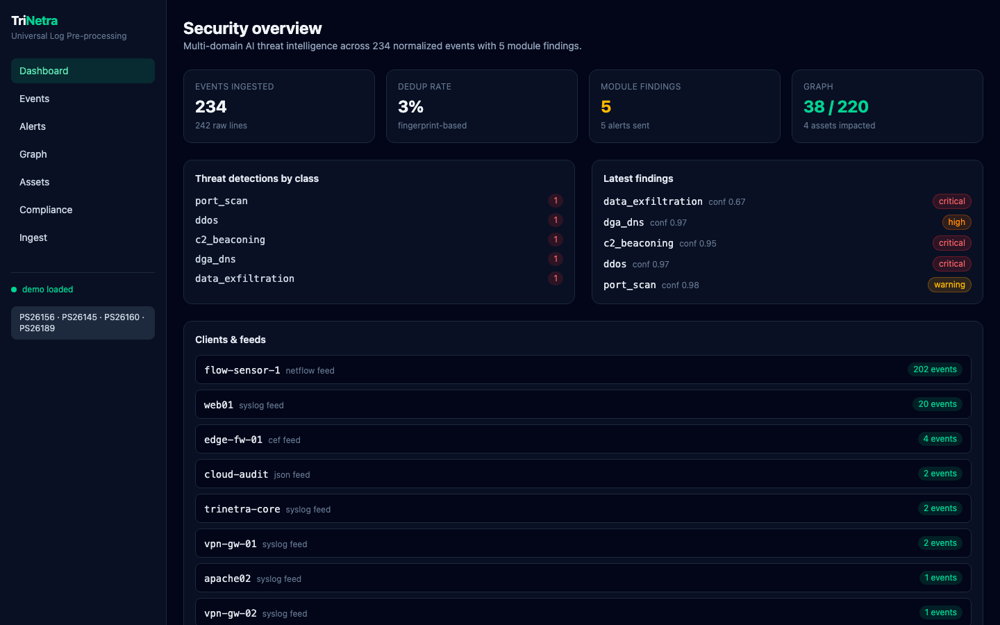
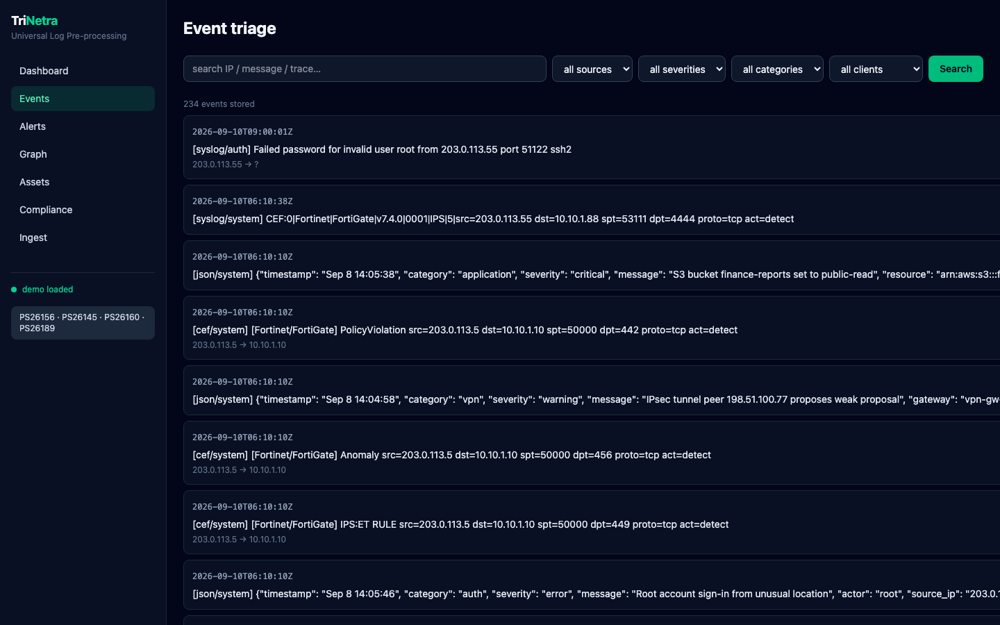
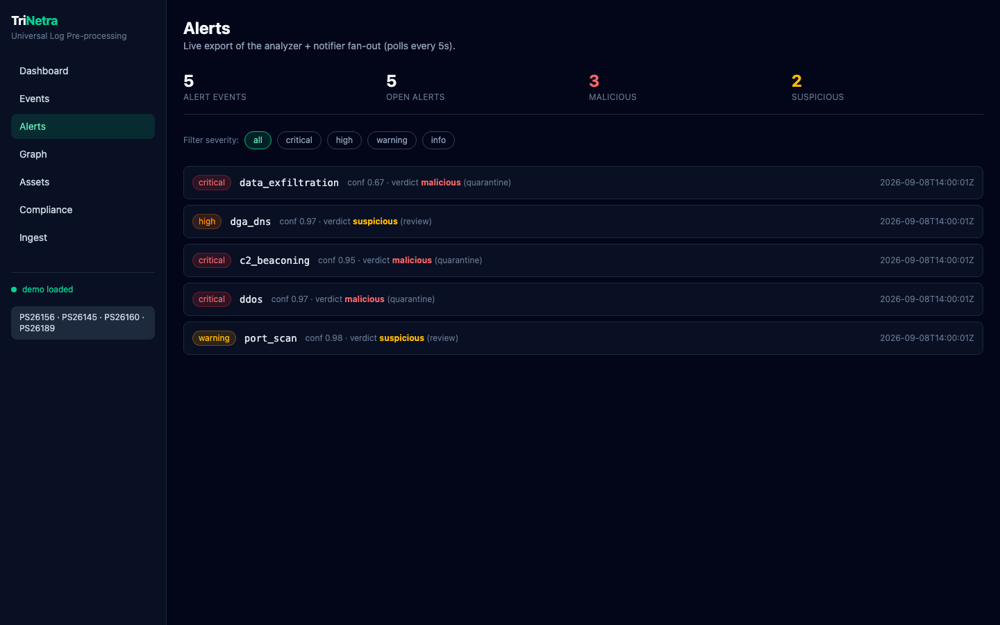
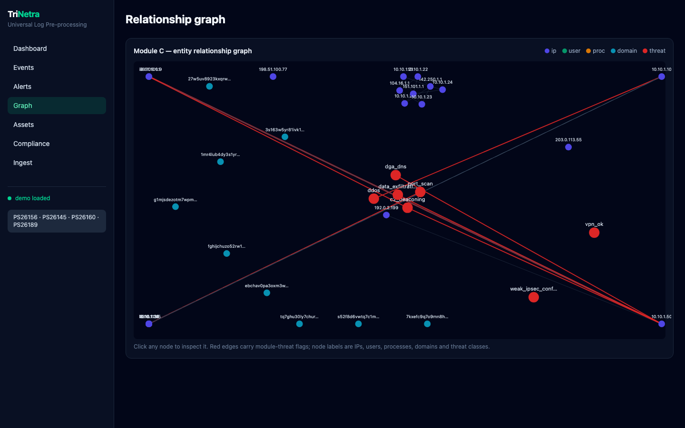
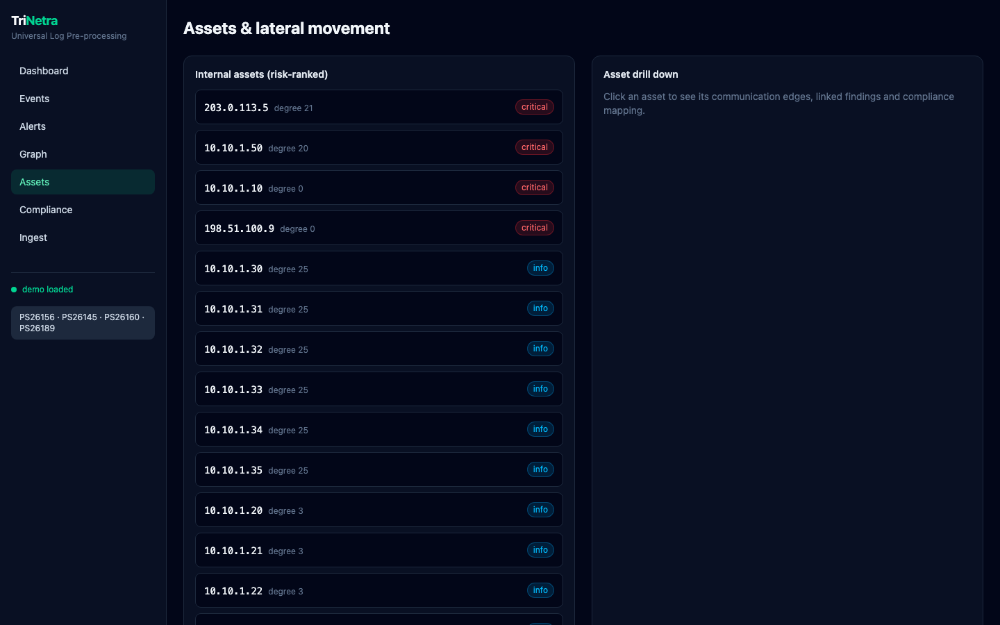
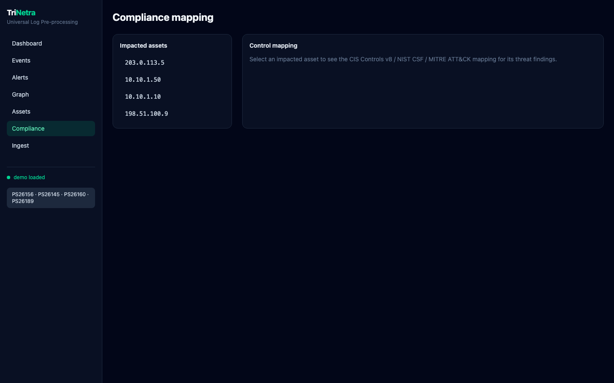
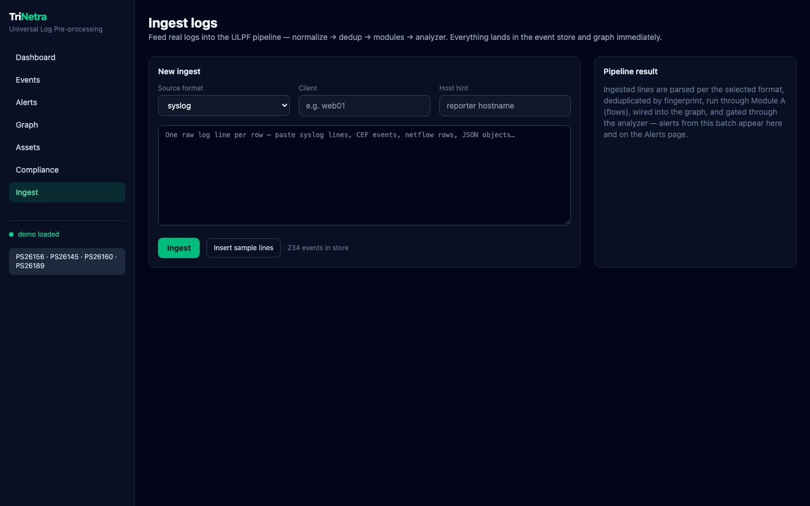

# TriNetra — demo walkthrough

A scripted, fully offline demo of the Universal Log Pre-processing Framework.
One security analyst story runs through every layer: raw logs → UES → threats →
LLM verdict → graph → compliance brief.

## 1 · Run it

```bash
# Local
python main.py --demo --json

# API + dashboard
python -m uvicorn backend.app.main:app --port 8000
# open http://localhost:8000 — or dev mode: cd frontend && npm install && npm run dev

# Container
docker compose up --build      # http://localhost:8000
```

The dashboard "Run demo dataset" button seeds the same story from the UI.

## 2 · The story (6 scenes)

One analyst shift at a mid-size LAN, told in generated syslog/CEF/JSON/netflow
events plus two captured VPN PCAPs:

| # | scene | evidence | module finding |
|---|---|---|---|
| 1 | **Recon** | external `203.0.113.5` probes many ports on `10.10.1.10`, then a FortiGate IPS rule fires | `port_scan` (warning) |
| 2 | **Brute force** | `sshd` failed-password storms for `root`/`admin` | (lateral context) |
| 3 | **DDoS** | 6 internal hosts hammer `10.10.1.10:80` (1818 pkts, 168 SYN) | `ddos` (critical) |
| 4 | **C2 beaconing** | `10.10.1.50` → `198.51.100.9:443` at a locked 7 s interval | `c2_beaconing` (critical) |
| 5 | **Data exfiltration** | `10.10.1.50` pushes **4.5 MB** to 3 external IPs | `data_exfiltration` (critical) |
| 6 | **DGA tunnel** | 9 high-entropy `.top` queries from the same host | `dga_dns` (high) |
| B | **VPN posture** | strong (IKEv2/AES-GCM-256/SHA2-256/DH-19/PFS/28800s) vs weak (IKEv1/3DES/MD5/DH-2/900s) PCAPs | 95 low / **0 critical** |

Heuristic analyzer verdicts:

```
ALERT: [WARNING]  port_scan       conf=0.98 verdict=suspicious (review)
ALERT: [CRITICAL] ddos            conf=0.97 verdict=malicious (quarantine)
ALERT: [CRITICAL] c2_beaconing    conf=0.95 verdict=malicious (quarantine)
ALERT: [HIGH]     dga_dns         conf=0.97 verdict=suspicious (review)
ALERT: [CRITICAL] data_exfiltration conf=0.67 verdict=malicious (quarantine)
```

## 3 · Dashboard tour



**Dashboard** — ingest (238 raw → 232 unique, 2.5 % dup), dedup rate, module
findings, alert fan-out, and the entity graph summary with the 4 impacted
assets. A **Clients & feeds** card lists every reporting endpoint
(`flow-sensor-1` netflow, `web01`/`vpn-gw-*`/`apache02` syslog, `edge-fw-01`
CEF, `cloud-audit` JSON) with per-client event counts drawn from
`GET /api/clients`.



**Events** — full event explorer: regex search over IPs / messages / trace-ids
(now also covering the parsed `fields` JSON, so `sshd` surfaces the auth
events), source-type, **client** and **category** filters with a live filtered
total, and a detail panel with the lossless raw event trace-back (every event
keeps its original log line).



**Alerts** — a live (5 s auto-refresh) view of analyzer fan-out: every verdict
from the pipeline with severity chips, verdict stats, and an expandable
evidence panel per alert (the raw flows that triggered the finding).



**Graph** — the Module C entity graph (`ip / user / proc / domain / threat`
nodes, `comm / dns / auth / exec` edges). Red edges are flagged by module
threats. 37 nodes / 220 edges for the demo story. **Click any node** to inspect
its connected edges and raw node data in a detail panel.



**Assets** — risk-ranked internal assets with threatened flags; drill into any
asset for its communication edges, linked findings, and mapped controls.



**Compliance** — each impacted asset gets a **CIS Controls v8 / NIST CSF /
MITRE ATT&CK** mapping with action-required status plus a generated markdown
analyst brief:

```markdown
# Compliance brief — 10.10.1.50 (3 control actions required)

## Actions by severity
* **CRITICAL** C2 beaconing → CIS 4.1, 13.1 … · NIST: DE.AE, PR.DS … · MITRE: T1071

## Recommendations
1. Isolate 10.10.1.50 and capture memory/network evidence.
2. … 
```



**Ingest** — feed live logs into the pipeline right from the dashboard:
pick a source format (syslog / CEF / JSON / CSV / netflow / windows), a
reporting client, optionally a host hint, paste raw lines (or insert a sample),
and watch them normalize → dedup → modules → analyzer in one round trip. Any
alerts in the batch fan out to the Alerts page. The **Dashboard** refreshes
itself every 10 s, and the **Events** page filters narrow the store live.

## 4 · Scoring

- **Demo run** `--demo --json`: 232 events, 5 findings, 5 alerts, ~0.1 s wall.
- **Tests**: `python -m pytest tests/ -q` → 33 passed (parsers, pipeline,
  modules A/B/C, analyzer, compliance, API).
- **CI**: pytest + Vite build + Docker build all green on every push.

## Reproducing the screenshots

```bash
cd frontend && npm install --no-save puppeteer-core   # dev tool only
python -m uvicorn backend.app.main:app --port 8000 &
curl -s -X POST 'http://127.0.0.1:8000/api/demo/run?reset=true' > /dev/null
node scripts/screenshot.mjs http://127.0.0.1:8000 screenshots
```